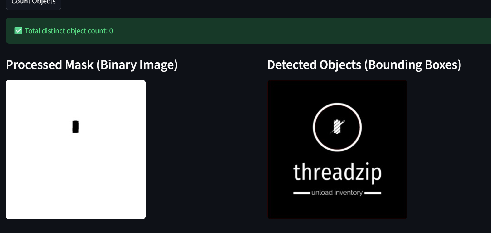
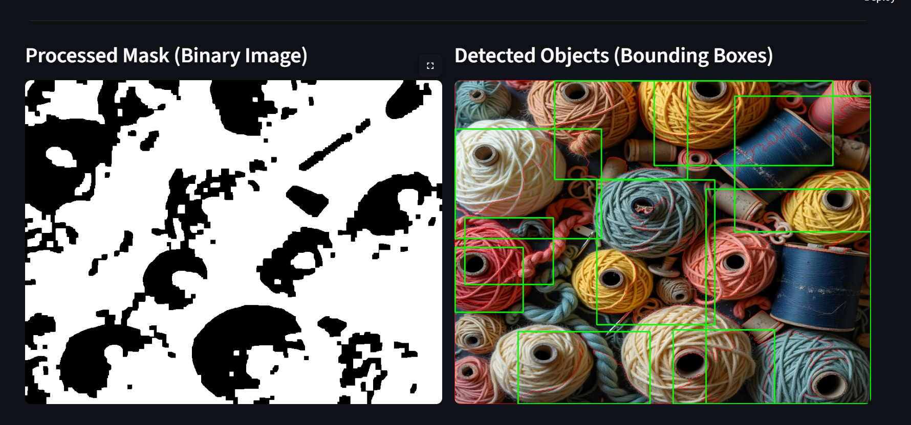
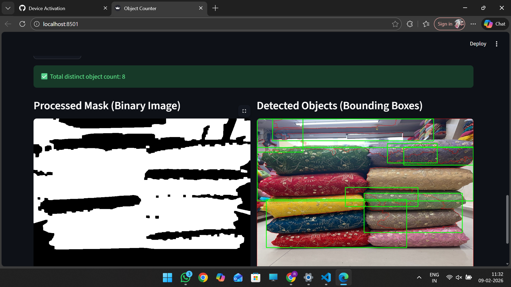
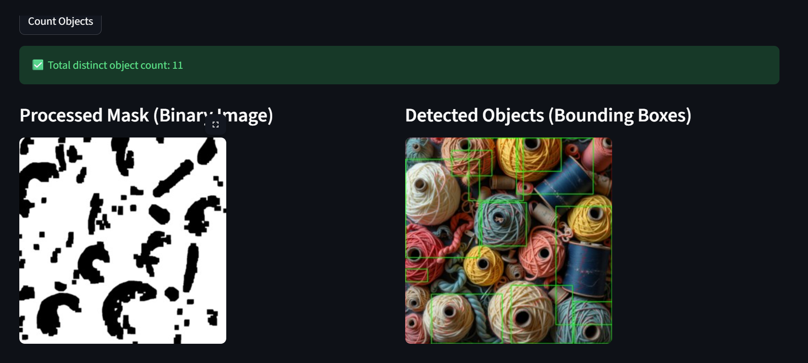
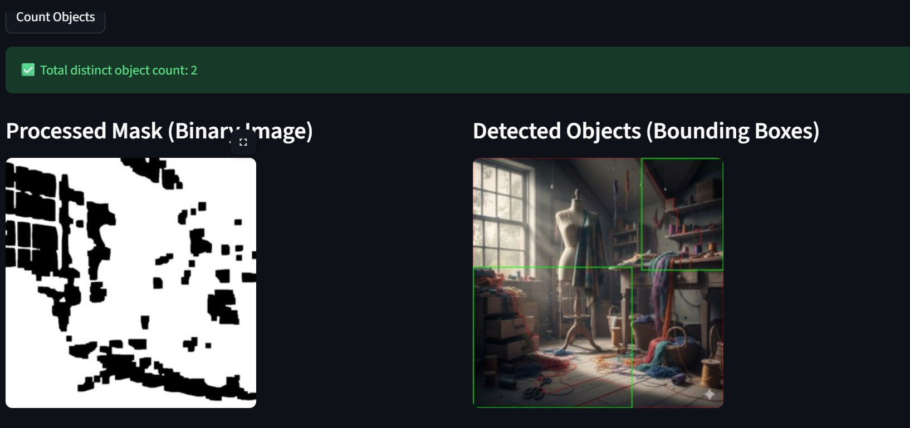
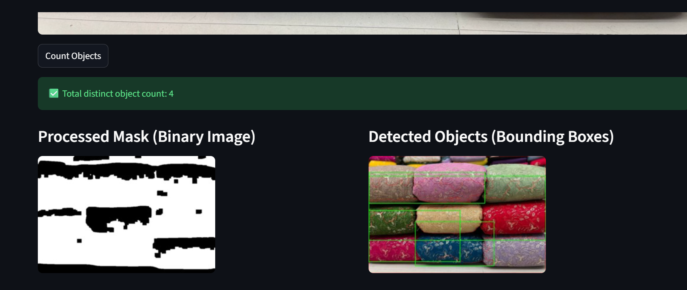

---

# 🧵 Cloth Stack Object Counter (ROI + Watershed Segmentation)

---

## 📌 Problem Statement

The objective of this assignment is to develop an object counting system that can detect and count **individual folded cloth stacks** from an input image.
Each cloth piece should be counted as a separate object and the output should include bounding boxes drawn around each detected cloth.

The major challenge is that cloth images contain:

* heavy texture / embroidery
* printed patterns
* low contrast boundaries
* background clutter

---

## 🎯 Project Goal

Given an image containing stacked cloth pieces, the system should:

✅ Detect the main stack region
✅ Segment individual cloth pieces
✅ Count the total number of cloth stacks
✅ Draw bounding boxes around each detected cloth
✅ Provide a simple UI for testing through Streamlit

---

## 🧠 Solution Approach (Traditional CV Pipeline)

This project uses a **two-stage Computer Vision pipeline**:

### 1️⃣ ROI Detection (Main Cloth Stack Extraction)

Instead of processing the full image, the algorithm first finds the main cloth stack region (ROI).

#### Method:

* Convert image from BGR → HSV
* Extract Saturation channel (S)
* Apply thresholding to detect highly saturated cloth regions
* Use morphological closing to merge nearby stack areas
* Detect contours
* Choose the **largest contour** as the main cloth stack region

This reduces noise from:

* floor background
* table edges
* side cloth bundles
* unwanted borders

---

### 2️⃣ Cloth Separation Using Watershed Segmentation

Once ROI is extracted, cloth objects are separated using **Watershed Segmentation**.

#### Why Watershed?

Cloth stacks often touch each other, making normal contour detection fail (merged objects).
Watershed helps split connected regions.

#### Steps:

* Convert ROI to grayscale
* Apply Gaussian blur (removes embroidery noise)
* Apply Otsu thresholding
* Morphological opening to remove small noise
* Dilate to compute sure background
* Distance Transform to compute sure foreground
* Apply connected components for markers
* Apply Watershed algorithm
* Extract each region as a separate object
* Filter noise using:

  * minimum area
  * minimum width/height

---

## 🛠️ Technologies Used

* **Python**
* **OpenCV**
* **NumPy**
* **Streamlit**
* **Pillow (PIL)**

---
## 📦 requirements.txt

txt
streamlit
opencv-python
numpy
pillow

---

## 🖥️ Application Workflow (Streamlit UI)

### UI Features:

* Upload image (`jpg`, `jpeg`, `png`)
* Display original image
* Click "Count Objects"
* Output includes:

  * Processed mask (binary segmentation)
  * Final detection image with bounding boxes
  * Total detected count

---

## 📌 Output Generated

The system generates:

### 1. Detected Count

Displays number of cloth stacks detected.

### 2. Processed Mask

Binary segmentation output used for object separation.

### 3. Bounding Boxes

Bounding rectangles drawn on each detected cloth object.

---

## 🧩 Code Explanation

### `object_counter.py`

This file contains the complete object counting logic.

#### Main Functions:

### `get_main_stack_roi(img)`

Finds the main cloth stack region using saturation-based masking and contour extraction.

* Output: ROI bounding rectangle and ROI mask.

---

### `count_objects_watershed(roi_img)`

Applies watershed segmentation inside the ROI to split cloth stacks.

* Output: object count, processed threshold mask, and bounding boxes.

---

### `count_cloth_stacks(image)`

Pipeline wrapper:

* Resizes image for stable detection

* Extracts ROI

* Applies watershed segmentation

* Draws ROI box + object bounding boxes

* Output: final count, processed mask, output image

---

### `app.py`

Streamlit UI file:

* Takes uploaded image
* Converts image to OpenCV BGR format
* Calls `count_cloth_stacks()`
* Displays results in UI columns

---

# 📊 Experimental Observations

## ✅ Strengths of This Approach

* Works without training data
* Lightweight and fast
* ROI detection reduces background noise
* Watershed helps split touching cloth stacks
* Suitable for controlled dataset environments

---

# ⚠️ Limitations & Their Consequences

## 1️⃣ Over-Counting Due to Embroidery / Printed Patterns

### Issue:

Embroidery patterns, floral designs, and texture lines can be detected as separate regions.

### Consequence:

Algorithm may detect internal cloth patterns as extra objects.

---

## 2️⃣ Under-Counting When Cloth Boundaries Are Weak

### Issue:

If two cloth pieces have very similar color/contrast, watershed may merge them.

### Consequence:

Multiple cloth pieces may be counted as a single object.

---

## 3️⃣ ROI Failure When Background Is Similar to Cloth

### Issue:

ROI extraction depends on saturation thresholding.

### Consequence:

ROI may incorrectly include background or exclude cloth stack edges.

---

## 4️⃣ Sensitive to Lighting Conditions

### Issue:

Low light reduces contrast and saturation.

### Consequence:

Thresholding becomes weak → segmentation fails → count becomes incorrect.

---

## 5️⃣ Parameter Sensitivity

### Issue:

Watershed relies heavily on threshold values (distance transform multiplier).

### Consequence:

Small changes may lead to:

* over-segmentation (too many objects)
* under-segmentation (too few objects)

---

## 6️⃣ Only Detects the Largest Stack (Main ROI)

### Issue:

Algorithm assumes the largest contour is the main stack.

### Consequence:

If multiple stacks exist, smaller stacks are ignored.

---

# 🚀 Future Improvements (Recommended)

## ✅ Deep Learning Solution: YOLOv8 Segmentation

To achieve robust and production-level accuracy, a deep learning segmentation model should be trained.

### Why YOLOv8-Seg?

* Learns true cloth boundaries
* Ignores embroidery patterns
* Works on rotated images
* Handles lighting variation better
* Performs better on complex backgrounds

---

## Optional Training Pipeline (Roboflow + YOLOv8)

### Steps:

1. Upload images to Roboflow
2. Create **Instance Segmentation** project
3. Annotate each cloth using Polygon tool (`class = cloth`)
4. Generate dataset version
5. Export as **YOLOv8 Segmentation**
6. Train model using Ultralytics YOLOv8
7. Use trained model for inference in Streamlit

---

## 🖼️ Screenshots

### 1. Streamlit UI (Upload Page)

---

### 📊 Sample Output
Example Output shown in the app:

---

# ✅ Conclusion

This project successfully demonstrates a Computer Vision-based object counting pipeline using:

* ROI extraction to isolate the main cloth stack
* Watershed segmentation to separate individual cloth objects
* Streamlit UI for user-friendly testing

While the approach performs well in many cases, it remains sensitive to texture, lighting, and overlapping cloth boundaries.
For improved generalization and accuracy, training a YOLOv8 segmentation model is recommended.

---